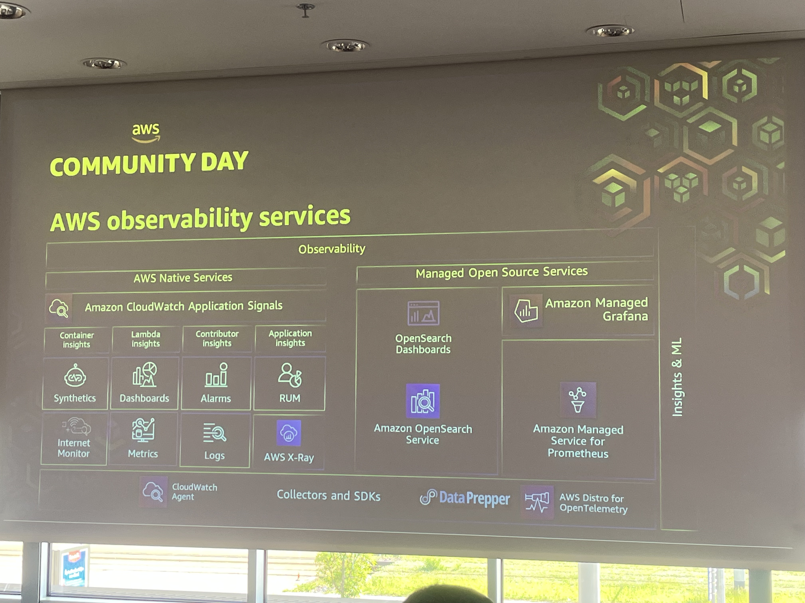
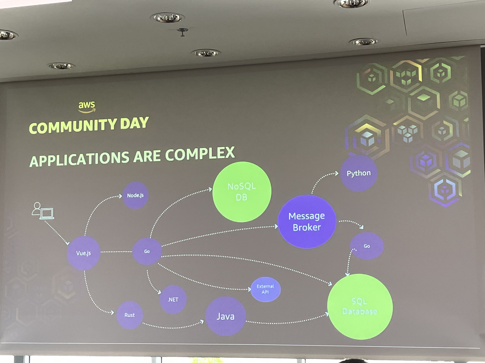
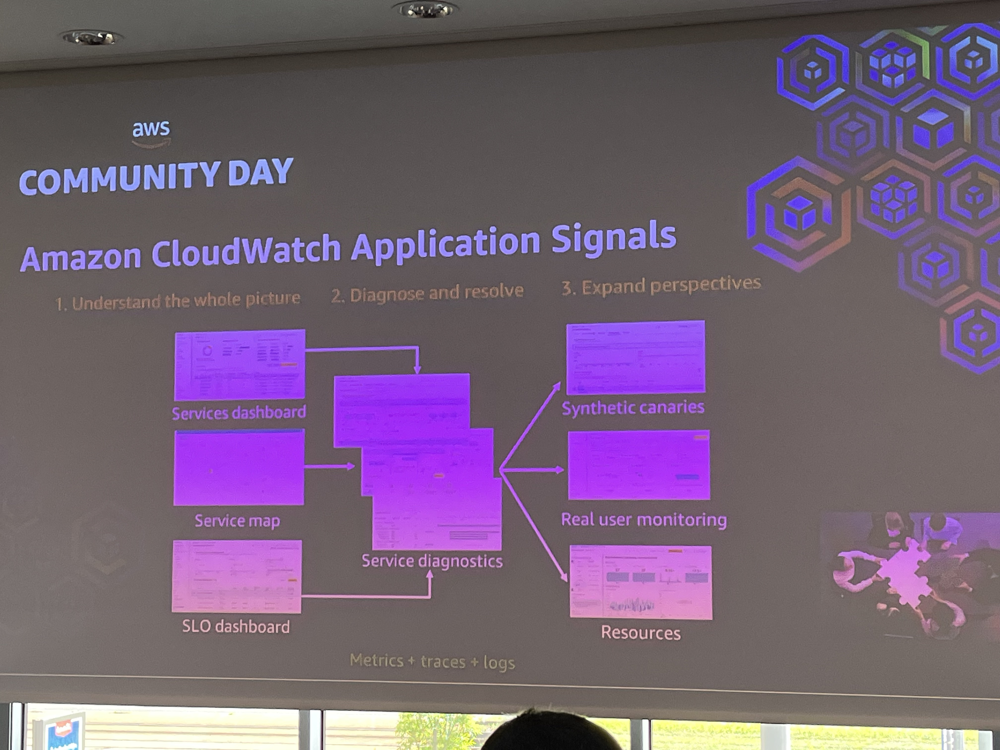
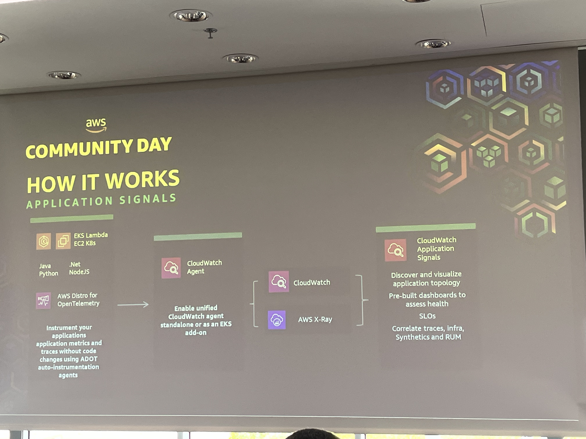
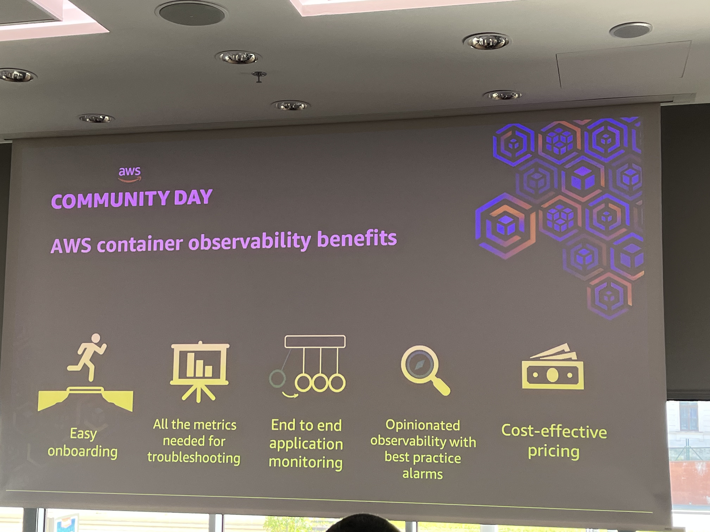

# AWS Container Observability - Application Performance Monitoring using Application Signal

[AWS Container Observability - Application Performance Monitoring using Application Signal](https://awscommunityday.cz/2025/sessions/acd1100/)
by [Michael Schmid](https://www.linkedin.com/in/msci/)

**Community Day**
> Wake-up call at 3:30 AM!
>
> How can I be equipped to tackle the challenge as fast as possible?

## AWS observability services

**AWS Native services VS Managed Open Source Services**

### Opensource observability as AWS manged Service

#### Pros

* Security first
* Production workloads
* Seamless Integrations
* Open source contribution

## Challenges in container observability

* Onboarding barriers
* What metrics to collect
* Impact analysis
* Opinionated observability with overall visibility
* Cost of observability

### Applications are complex

### The complexity challenge

1. Complex distributed systems enable teams to scale and deliver features more quickly, but are more difficult to
   monitor.
2. Builders are spending more time to detect and resolve the root cause of production issues.

### End-To-End visibility

> Needed to identify the impact on the customer.
> * What is customer feeling?
> * What does customer see?

## Key application monitoring metrics

_THE GOLDEN SIGNALS OF APM_

1. Volume of requests
    * Demand placed on the system. Changes in traffic can impact resources and affect latency
2. Latency
    * The time it takes to server a request. Latency directly impacts user experience.
3. Faults
    * Rate of failed requests as a result of an application issue.
4. Errors

### Addressing customers needs

1. Discover services
2. Standard application metrics
3. Service Level Objectives
    * Set reliability goals based on business objectives.
4. Navigate from metrics to root cause in 3 clicks
    * Click from metrics to correlate trace, then drill into the specific resource, such as a container pod, to
      establish a root cause.

# Amazon CloudWatch application Signals

1. Understand the whole picture
2. Diagnose and resolve
3. Expand perspectives

## How does it work?

_application signals_

1. Collect metrics
2. Discover Services
3. Troubleshooting with metrics and traces
4. Set SLOs
5. Synthetics & Client integrations

## AWS CONTAINER observability benefits

1. Easy onboarding
2. All the metrics needed for troubleshooting
3. End to end application monitoring
4. Opinionated observability with best practice alarms
5. Cost-effective pricing
